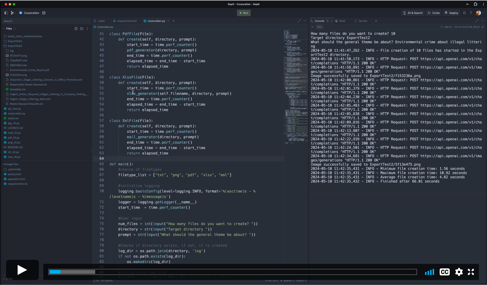

## AutoGenerativeAIDownloader
Proof of Concept - Part of UC2ST210 ST2 Team 13 Group Project: The Role of Artificial Intelligence in the Development of Digital Forensics Training Images.

This script will:
1. Reads prompt-strings from the 'Prompt' column header in main.csv, then generates the respective images using OpenAI's DALLE2 API.
2. Downloads the newly generated images to the 'generated_images' folder.
3. Writes the path and filename to the corresponding column 'GeneratedImages' in main.csv.

 
Remember to add a valid API key. Guid for setting an environment variable [here](https://help.openai.com/en/articles/5112595-best-practices-for-api-key-safety)

### Script Overview

*Sequence diagram detailing the interactions between the scripts image-generator function, local files, and OpenAI.*

### Demo: Image Generator Script

### Demo: AI Corpora Generator

